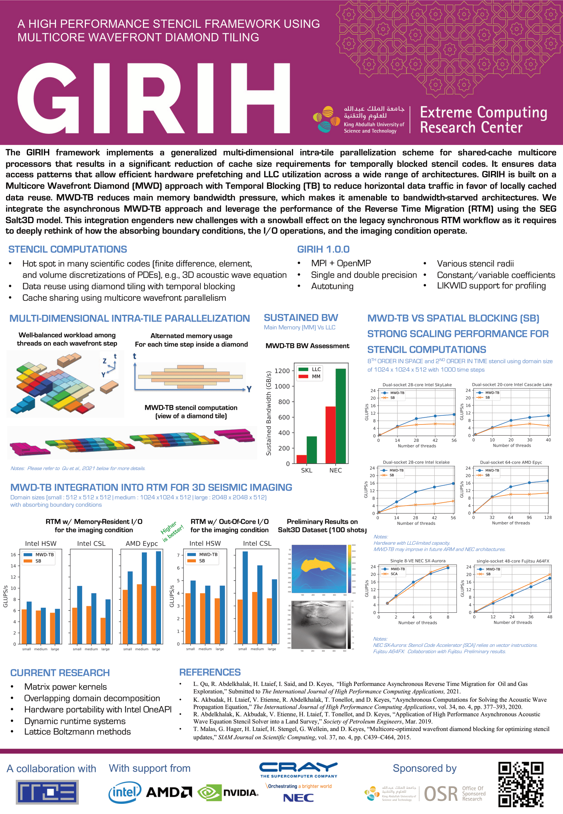

GIRIH
============

#### Introduction
This tool serves as a test harness for different optimization techniques to
improve stencil computations performance in shared and distributed memory
systems. Spatial and temporal blocking techniques are implemented across all 
implemented stencil operators. The tool is mainly used to develop and analyze 
the performance of Multi-core Wavefront Diamond (MWD) tiling techniques, which 
are used to perform temporal blocking. Naive, halo-first, and diamond tiling 
options are implemented for MPI communication in distributed memory setup. The 
project supports star stencil operators at different orders in space and time 
and with constant/variable coefficients and different coefficients' symmetry 
options. It provides means to verify the results' correctness of the optimized 
stencil kernels using the results of unoptimized serial reference 
implementations. Timing routines are inserted manually in the code to measure 
the performance of the main components of the code, including computation, 
communication, and idle time.
LIKWID performance tool is used to perform measurements through hardware 
counters at regions of interest in the code. This enables the user to accurately 
measure the memory bandwidth, energy consumption, TLB misses, and other 
supported groups at LIKWID.


#### Installation & compilation
Use conf/make.conf file to set the Makefile variables to the 
desired compiler binaries and flags. The main make targets are:
* dp: Used to set the problem data to double-precision.
* debug: Used for debugging and verification builds.

The make command creates build directory according to the selected precision for 
the executable "mwd_kernels" and the object files. dp make target creates "build_dp" 
directory and the default build creates "build" directory.


#### Usage
The list of available parameters can be printed by passing the argument --help.
To see all available stencil operators and optimization techniques, pass the 
argument --list.

#### Examples
##### Run 7-point constant-coefficient stencil using a grid of size 512^3 and 500 time steps, using the relaxed-synchronzation wavefront MWD algorithm (Auto-tuning may take time, given that no tile size nor thread group size are selected)

```sh
export OMP_NUM_THREADS=12
./build_dp/mwd_kernel --nx 512 --ny 512 --nz 512 --nt 500 \ 
                      --target-kernel 1 --mwd-type 2 --target-ts 2
```

#### Performance output summaries
Manual timing routines (using MPI_Wtime) are used to collect the time spent in:
  1) Computation
  2) Communication (including waiting time)
  3) Waiting at MPI_Wait/MPI_Waitall and MPI_Barrier
  4) Total time of the time stepper, including the waiting time at the barrier
     that is used to synchronize with other MPI processes after completing the 
     time stepper work
  5) Other parts of the code, where this value =total-computation-communication.
     This value is useful to check if any significant time is spent elsewhere

Additional timing measurements are printed at the MWD implementation. They 
include details about the time distribution of each thread and thread group 
during the runtime.

A successful experiment prints out statistics about the timing results above. 
The maximum, minimum, and mean values are printed along with Rank0 timing 
results.


#### Helpful scripts
Several Python scripts (available under scripts/) are used to run experiments 
for performance measurements and verification regression tests.
- `verification/run_verification.py 0 1 2`: 
       Runs a regression test over the standard and MWD implementations. It 
       runs a combination of topology sizes and domain sizes and other 
       parameters with verification 

- `verification/run_short_verification_0to1.py`:
       Runs a short version of the regression test over the naive and halo-first
       implementations

- `verification/run_short_verification_intra_diamond.py`:
       Runs a short version of the regression test over the MWD implementations

- `parse.py exper-file-1 exper-file-2 ...exper-file-n`:
       This script takes multiple files, each contains the output of individual
       experiment. The parsed results are written in CSV format in summary.csv

- Experiment submission scripts: 
        Most of the remaining scripts are used to run experiments at systems 
        with job scheduler (for example, Shaheen at KAUST). These scripts should 
	be executed from the root directory of the project


#### Current research
*  Matrix power kernels
*  Overlapping domain decomposition 
*  GPU hardware accelerators:
*  OpenACC / CUDA 
*  Out-of-core algorithms
*  Dynamic runtime systems
*  Extension to CFD applications


#### References
1. Multi-Dimensional Intra-Tile Parallelization for Memory-Starved Stencil Computations,
T. Malas, G. Hager, H. Ltaief, and D. Keyes,
*ACM Transactions on Parallel Computing*, 2017.
2. T. Malas, J. Hornich, G. Hager, H. Ltaief, C. Pflaum, and D. Keyes, Optimization of an
Electromagnetics Code with Multicore Mavefront Diamond Blocking and Multi-Dimensional Intratile
Parallelization, *IEEE International Parallel and Distributed Processing Conference*, 2016.
3. Multicore-Optimized Wavefront Diamond Blocking for Optimizing Stencil Updates,
T. Malas, G. Hager, H. Ltaief, H. Stengel, G. Wellein, and D. Keyes,
*SIAM Journal on Scientific Computing*, 37:4, C439-C464, 2015.
4. T. Malas, G. Hager, H. Ltaief, and D. Keyes, Towards Fast Reverse Time Migration Kernels
using Multi-threaded Wavefront Diamond Tiling, *2nd EAGE Workshop on High Performance
Computing for Upstream*, arXiv:1410.5561, 2015.

#### Help
Please feel free to create an issue on Github for any questions and inquiries.


